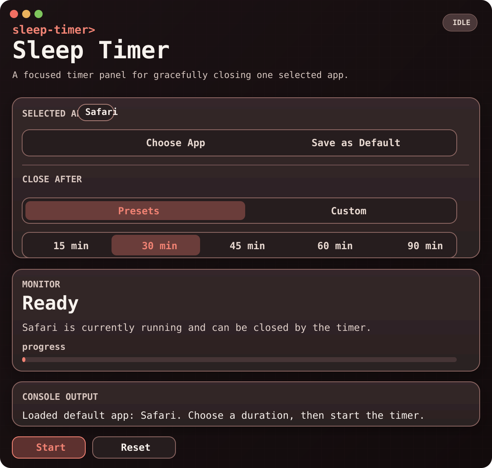

# Sleep Timer

Sleep Timer is a native SwiftUI macOS app that closes a selected application after a configurable delay.

## Screenshot



## Features

- Choose any installed macOS app to target.
- Save the selected app as the default choice for future launches.
- Pick a preset delay of 15, 30, 45, 60, or 90 minutes, or enter a custom duration from 1 to 720 minutes.
- Start, cancel, restart, or immediately trigger the shutdown flow.
- Present the controls in a restrained console-inspired interface.
- Switch between green and red console themes from the macOS menu bar.
- Show a 10-second warning phase before the selected app is closed.
- Close the target app gracefully through AppKit if it is running.

## Requirements

- macOS 13 or later
- Xcode command line tools with Swift 6 support

## Project Layout

- `Package.swift`: Swift package definition
- `Sources/SleepTimer/main.swift`: SwiftUI app and timer logic
- `Support/Info.plist`: app bundle metadata
- `Support/AppIcon.icns`: bundled app icon
- `build_app.sh`: release build and app bundle packaging script
- `build_release_zip.sh`: release zip packaging script
- `generate_homebrew_cask.sh`: generates the Homebrew cask for a tagged release

## Build

Build the debug target:

```bash
swift build
```

Build the packaged macOS app bundle:

```bash
./build_app.sh
```

Build the release zip used by Homebrew:

```bash
./build_release_zip.sh
```

The packaged app is created as:

```bash
Sleep Timer.app
```

## Run

Launch the packaged app from Finder, or run it from the project directory:

```bash
open -n "Sleep Timer.app"
```

## Homebrew

Sleep Timer is distributed through the dedicated private tap repository `anteris90/homebrew-macos-app-sleep-timer`.

Install from the tap with GitHub access to that private repository:

```bash
brew tap anteris90/macos-app-sleep-timer https://github.com/anteris90/homebrew-macos-app-sleep-timer
brew install --cask sleep-timer
```

Pushing a tag like `v1.0.0` triggers the release workflow in `.github/workflows/release.yml`, which builds `SleepTimer.zip`, publishes the GitHub release, and updates the cask in the tap repo automatically. The workflow expects a repository secret named `HOMEBREW_TAP_PAT` with permission to push to the tap repo. Because the tap is private, anonymous public `brew tap` installs are no longer available.

## How It Works

1. Choose the app you want to close.
2. Optionally save it as the default app.
3. Select a preset delay or enter a custom duration.
4. Start the timer.
5. When the timer expires, Sleep Timer enters a 10-second warning state.
6. If not cancelled or restarted, the selected app is terminated gracefully.

## Notes

- The app targets running applications by bundle identifier when available.
- Default app selection is stored locally using a persisted bookmark.
- The GitHub repository name may differ from the shipped app name.